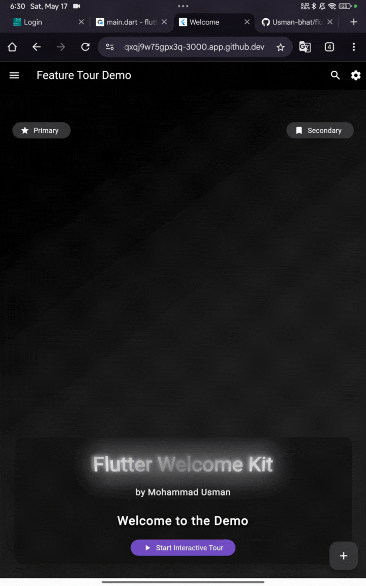
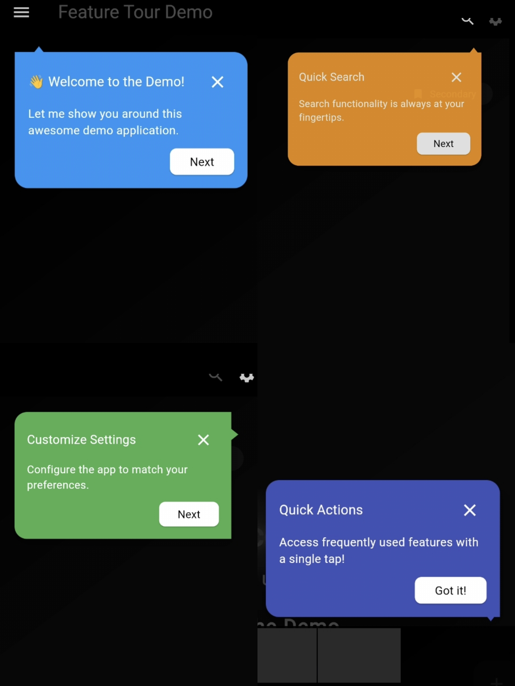

# Flutter Welcome Kit 🎉

A beautiful, customizable onboarding/tour guide kit for Flutter apps. Highlight widgets, display tooltips, and guide your users step by step — perfect for tutorials and product tours.

[](https://pub.dev/packages/flutter_welcome_kit)
[](https://pub.dev/packages/flutter_welcome_kit)
[](https://pub.dev/packages/flutter_welcome_kit)
[](https://opensource.org/licenses/MIT)

## Demo



## Live Demo

Try the live demo at: https://usman-bhat.github.io/flutter_welcome_kit/

## Features

✨ Smart positioning system that automatically places tooltips in optimal locations  
🎯 Highlight any widget using `GlobalKey`  
🔥 Animated tooltips with smooth transitions  
🎨 Multiple animation types (fade, slide, scale, bounce, rotate)  
🌈 Customizable background color per step  
⏱️ Auto-advance steps with configurable duration  
🎮 Interactive or non-interactive mode  
📱 Responsive design that adapts to screen edges  
⌨️ Keyboard navigation support  
♿ Accessibility support  
📝 RTL support

## Installation

Add to your `pubspec.yaml`:

```yaml
dependencies:
  flutter_welcome_kit: ^1.0.0
```

## Quick Start

```dart
// 1. Create global keys for widgets you want to highlight
final logoKey = GlobalKey();
final searchKey = GlobalKey();

// 2. Define your tour steps
final steps = [
  TourStep(
    key: logoKey,
    title: "👋 Welcome!",
    description: "Let's take a quick tour of the app.",
    backgroundColor: Colors.blue.shade50,
  ),
  TourStep(
    key: searchKey,
    title: "Search",
    description: "Find anything instantly.",
    backgroundColor: Colors.orange.shade50,
  ),
];

// 3. Start the tour
TourController(context: context, steps: steps).start();
```

## Customization




## TourStep Parameters

| Property | Type | Description |
|----------|------|-------------|
| key | GlobalKey | Target widget key |
| title | String | Tooltip title |
| description | String | Tooltip content |
| backgroundColor | Color | Tooltip background color |
| animation | StepAnimation | Animation type for the tooltip |
| preferredSide | TooltipSide? | Preferred tooltip position |
| duration | Duration | Time before auto-advance |
| buttonLabel | String? | Custom button text |
| isLast | bool | Marks the last step |
| pointerPadding | double | Padding around highlighted element |
| pointerRadius | double | Corner radius of highlight |

## Available Animations

- `fadeSlideUp`
- `fadeSlideDown`
- `fadeSlideLeft`
- `fadeSlideRight`
- `scale`
- `bounce`
- `rotate`
- `none`

## Tooltip Positioning

The toolkit automatically calculates the optimal position for tooltips using these options:

- `top`
- `bottom`
- `left`
- `right`
- `topLeft`
- `topRight`
- `bottomLeft`
- `bottomRight`

## Example Usage

```dart
TourStep(
  key: buttonKey,
  title: "Smart Positioning",
  description: "Tooltips automatically position themselves optimally!",
  backgroundColor: Colors.purple.shade50,
  animation: StepAnimation.bounce,
  preferredSide: TooltipSide.bottom,
  pointerPadding: 30,
  pointerRadius: 28,
  duration: const Duration(seconds: 4),
  isLast: false,
)
```


## Contributing

PRs welcome! Feel free to submit issues, suggestions, or improvements.
